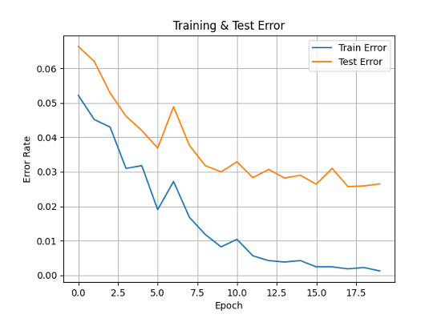
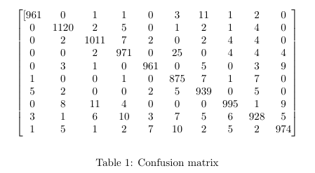

# My-LeNet-5-CNN

# LeNet-5 (RBF Output Layer) — Digit Classification in PyTorch

This project implements a **LeNet-5 style CNN** in **PyTorch** with a **Radial Basis Function (RBF) classifier** head (prototype-based classification), trained on an MNIST digit dataset organized in folders `0/` through `9/`.

Unlike a standard softmax classifier, this model computes the **squared Euclidean distance** between the learned feature vector and **fixed class prototypes** (RBF centers) generated from the dataset.

---

## Features

- LeNet-5 style architecture (Conv → AvgPool → Conv → AvgPool → Conv → FC)
- **Squashing nonlinearity**: `1.7159 * tanh((2/3) * x)` (classic LeNet-style)
- **RBF output layer** using **prototype centers** (`10 × 84`)
- Prototype generation:
  - average images per class
  - downsample to **7×12**
  - binarize to **{-1, +1}**
  - flatten to 84-dim vector per class
- Custom **MAP-style loss** for distance-based classification

Results with Epoch = 20 --> Train Error = 0.0012 & Test Error = 0.0265

Most Misclassified Digits:

Digit 0 misclassified as 2 (score = 24.716)

Digit 1 misclassified as 8 (score = 85.803)

Digit 2 misclassified as 4 (score = 41.215)

Digit 3misclassified as 9 (score = 29.772)

Digit 4misclassified as 9 (score = 54.728)

Digit 5misclassified as 0 (score = 30.610)

Digit 6misclassified as 1 (score = 56.688)

Digit 7misclassified as 8 (score = 47.993)

Digit 8misclassified as 9 (score = 42.593)

Digit 9misclassified as 7 (score = 57.392

